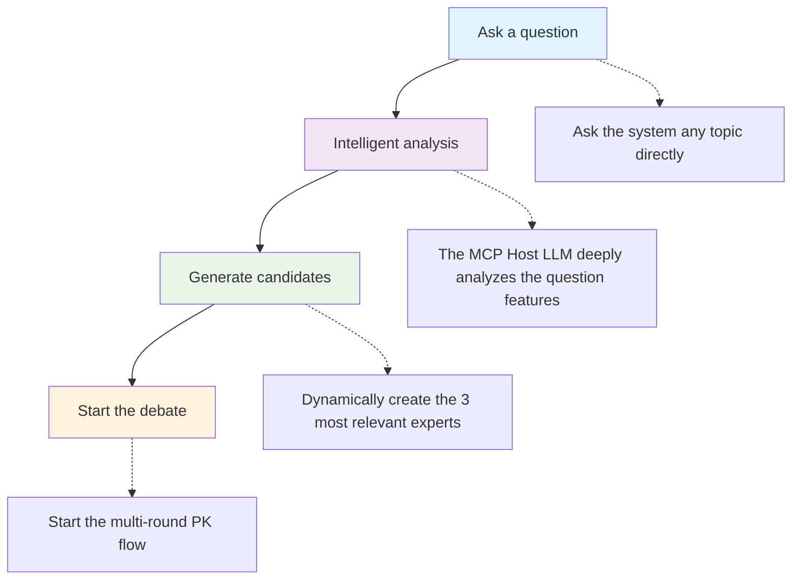
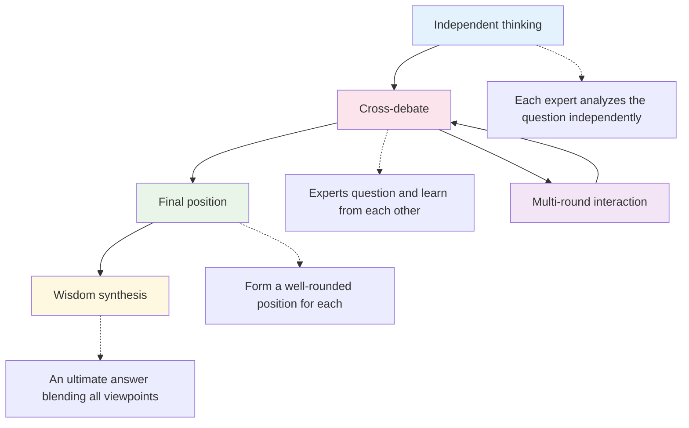

# guru-pk-mcp

Based on the local MCP (Model Context Protocol), the AI expert debate system adopts a dynamic expert generation architecture, intelligently creating the most suitable combination of experts for multi-…

# Guru-PK MCP Intelligent Expert Debate System

An AI expert debate system based on the local MCP (Model Context Protocol), adopting a **dynamic expert generation architecture** to intelligently create the most suitable combination of experts for multi-round intellectual collisions according to the question.

## ✨ Core Features

- 🏭 **Dynamic Expert Generation** - Fully problem-driven, generating a unique set of experts each time
- 🌟 **Infinite Expert Pool** - Breaking through the limitations of fixed experts, supporting the generation of experts in any field
- 🔄 **Multi-Round PK Process** - Independent Thinking → Cross-Debate → Final Position → Wisdom Synthesis
- 🎨 **Tufte Style Infographics** - Transforms expert debates into a single-page dynamic infographic strictly following the design principles of data visualization master Edward Tufte
- 🤖 **Intelligent Division of Labor Architecture** - The LLM at the MCP Host end is responsible for intelligent analysis, while the MCP Server end provides process guidance

## 🌐 Online Demo

**👉 [View Infographic Demo](https://mitsudoai.github.io/guru-pk-mcp/)**

This webpage showcases a Tufte-style dynamic infographic created using this MCP tool, vividly demonstrating the powerful capabilities of the expert debate system.

## 🚀 Quick Installation

### 1. Install Dependencies

**Method One: Using the Installation Script (Recommended)**

**macOS/Linux:**

```bash

curl -LsSf https://astral.sh/uv/install.sh | sh

```
**Windows:**

```powershell

powershell -ExecutionPolicy ByPass -c "irm https://astral.sh/uv/install.ps1 | iex"

```
**Method Two: Installing via pip (Suitable for All Platforms)**

```bash

pip install uv

```
**Method Three: Downloading the Installer Package**

Download the installer package for your platform from the [UV Releases](https://github.com/astral-sh/uv/releases) page

### 2. Configure MCP Client

**Recommended Method: Install from PyPI**

```json

{

  "mcpServers": {

    "guru-pk": {

      "command": "uvx",

      "args": ["--from", "guru-pk-mcp", "guru-pk-mcp-server"],

      "env": {

        "DATA_DIR": "~/.guru-pk-data"  // macOS/Linux: ~/ directory, Windows: %USERPROFILE% directory

      }

    }

  }

}

```
> **Update Notes**:
>
> - When updating `guru-pk-mcp` to the latest version, run the command:
>
>   bash
>   uvx pip install --upgrade guru-pk-mcp
>   
>
> - This command fetches and installs the latest release from PyPI
> - If you encounter cache issues, you can force a refresh:
>
>   bash
>   uvx --refresh-package guru-pk-mcp --from guru-pk-mcp python -c "print('✅ UVX cache refreshed')"
>   
>
> **Note**:
>
> - macOS users may need to use the full path: `/Users/{username}/.local/bin/uvx`
> - Windows users: `~` will automatically resolve to the user's home directory (e.g., `C:\Users\{username}`), no manual modification needed

**Development Method: Install from Source Code**

```json

{

  "mcpServers": {

    "guru-pk": {

      "command": "uvx", 

      "args": ["--from", "/path/to/guru-pk-mcp", "guru-pk-mcp-server"],

      "env": {

        "DATA_DIR": "~/.guru-pk-data"  // macOS/Linux: ~/ directory, Windows: %USERPROFILE% directory

      }

    }

  }

}

```
> **Local Development Notes**:
>
> - For local development scenarios, if you need to refresh the uvx cache, use `make refresh-uvx`
> - This command forces UVX to reinstall the local package, ensuring the latest code changes are used

## Getting Started

Restart the MCP client, enter `guru_pk_help` to get help, or start asking questions directly to begin the expert debate!

```javascript

// 1. Ask in natural language (the most recommended way)

In the field of generative AI, is there a direction especially suitable for personal entrepreneurship? Let three experts debate

// 2. Intelligently generate candidate experts (executed automatically by the system)

start_pk_session: In the field of generative AI, is there a direction especially suitable for personal entrepreneurship?

// 3. Intelligently generate candidate experts (the user limits the expected expert scope)

start_pk_session: In the field of generative AI, is there a direction especially suitable for personal entrepreneurship? Find two big names in the AI field and a well-known personal entrepreneur to debate

```
### 💡 Usage Tips

**Starting a Debate**:

- **`start_pk_session:direct question`** - Default efficient batch processing mode (recommended)
- **`start_stepwise_pk_session:direct question`** - Traditional step-by-step dialogue mode

**Tool Functions**:

- 📋 `guru_pk_help` - Get system introduction and detailed help
- 📄 `export_session` - Export session as a Markdown file
- 🎨 `export_session_as_infographic` - Export session as a Tufte-style single-page dynamic infographic
- 📄 `export_enhanced_session` - Export enhanced analysis report
- 🌍 `set_language` - Set the language for expert responses

### 📱 Compatibility

Supports all MCP-compatible applications: Claude Desktop, Cursor, TRAE, DeepChat, Cherry Studio, etc.

### 🎯 Recommended Configuration

**Most Recommended MCP Host**:

- 💰 **Subscription-based MCP Host calculated by user requests** - Such as Cursor and the overseas version of Trae
- 🌟 **Advantages**:
  - Significant cost advantage: Subscription fees are based on user requests rather than API calls or token usage
  - Claude model offers the best support for MCP with excellent instruction-following capability

### ⚠️ Not Recommended Configuration

- 🚫 **Trae Domestic Version** - The built-in domestic models have sensitive word censorship, which may interrupt the expert debate process and affect the user experience

## 🛠️ Technical Architecture

**Principle of Intelligent Division of Labor**:

- 🧠 **LLM at MCP Host End**: Responsible for complex semantic analysis and intelligent generation
- 🔧 **MCP Server End**: Provides simple process control and data management

### Dynamic Expert Generation Process


### 🔄 Debate Process

**Two Debate Modes**:

🚀 **Batch Mode** (`start_pk_session`) - **Default Recommended**

- ⚡ High Efficiency: Generates all expert responses in one round, saving about 60% of the time- 🎯 Applicable Scenarios: Quickly obtain multi-perspective analysis for efficient decision support

🔄 **Step-by-Step Mode** (`start_stepwise_pk_session`) - Traditional Experience

- 🎭 Interactivity: Experts speak one by one, allowing real-time adjustments and in-depth discussions
- 🎯 Applicable Scenarios: Deep reflection, enjoying the full debate process

**4-Round Debate Process**:


## 💭 Design Philosophy

### Inspiration Source

The initial expert system of this project was inspired by the [Life Coach Team Agent](https://mp.weixin.qq.com/s/QGNzRRo7U3Y2fmvOXNJvyw), implementing the innovative idea of multi-role PK among built-in experts through a local MCP approach.

### Technical Solutions Comparison

**🔧 Agent Framework Development**

- ✅ Powerful, capable of integrating multiple LLM APIs
- ✅ Flexible front-end interaction with strong control
- ❌ High development complexity and costly API calls

**☁️ Third-Party Document Service Remote MCP Solution (Feishu MCP)**

- ✅ Simple deployment, leveraging existing ecosystems
- ❌ Dependent on third-party services with limited customization

**🏠 Local MCP Solution (This Project)**

- ✅ Integrated with subscription-based chat apps, no API fees
- ✅ Data localization and privacy protection
- ✅ Open-source and customizable, technologically independent
- ✅ **Intelligent Division of Labor Architecture** - Fully utilizing the intelligence of the LLM at the MCP Host end
- ✅ **Dynamic Expert Generation** - Breaking through the limitations of a fixed expert pool
- ❌ Dependent on the implementation of the MCP client

The latest design of this project achieves a fundamental breakthrough from a fixed expert library to an intelligent expert factory through complete dynamic expert generation. Leveraging the intelligence of large language models at the MCP Host end, the MCP server-side (this project) focuses on process control, reducing maintenance costs, and achieving the optimal balance between intelligence and simplicity.

**Official site: ** [https://github.com/MitsudoAI/guru-pk-mcp](https://github.com/MitsudoAI/guru-pk-mcp)
**Status: ** `active`　**Last verified: ** `2026-08-30`

## Categories & Tags

- Categories: `communication`, `data`
- Tags: `research and data`, `knowledge and memory`, `communication`, `专家pk, 大神pk, 专家辩论`, `chinese`

## MCP Configuration

- Transport: `stdio`
- Command: `uvx`
- Args: `--from guru-pk-mcp guru-pk-mcp-server`

This config can be imported into ChatSpeed from the resource index. Verify the command, arguments, and permission source are trustworthy before importing.

## Data source

Resource file: `resources/mcp/chuenlye-guru-pk.json`. Content last verified on `2026-08-30`; free quotas and service limits may change with official policies.
