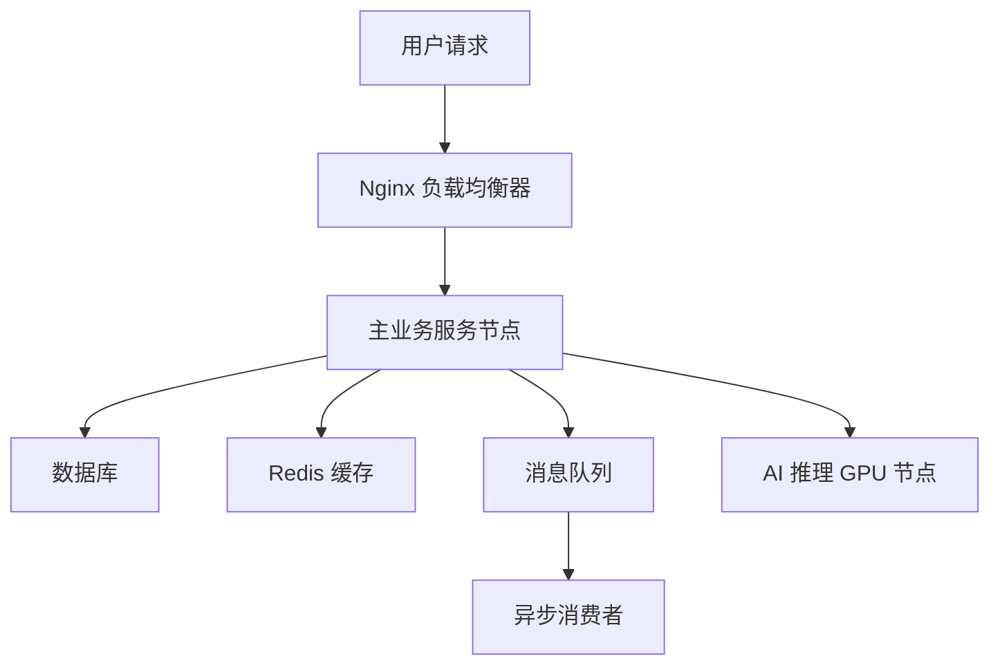

# mcp-system-infra

Smart Architecture Recommendation Engine: Tailored for Your System 随着技术的不断发展，选择最适合您需求的技术栈变得越来越复杂。为了帮助开发者和架构师做出更加明智的选择，我们推出了智能架构推荐引擎（Smart Architecture Recommendation Engine, SARE）。SARE利用先进的算法分析您的项目需求，…

# 🚀 Intelligent Architecture Recommendation Engine: Tailored for Your System

In today's rapidly evolving digital business landscape, how can one quickly and efficiently build a scalable, stable, and reliable technical architecture? The **Intelligent Architecture Recommendation Engine** is here to solve this problem.

Based on key parameters — QPS (Queries Per Second), concurrent users, daily active users, business type, database selection, and AI model size — we automatically generate:

- 💡 Optimal server resource configuration
- 🧩 Required middleware module combinations
- 🏗️ Recommended overall system architecture
- ☁️ Recommended cloud service providers and deployment strategies
- 📊 Markdown report + one-click export of architectural diagrams

---

## ✨ Core Advantages

### ✅ Fully Parameter-Driven, Closely Aligned with Business Reality

You only need to input the following parameters:
- `--qps`: Peak throughput of the business
- `--concurrentUsers`: Number of concurrent connections
- `--uad`: Daily Active Users (UAD)
- `--type`: Type of business (web / ai)
- `--db`: Database type (relational / nosql / analytics)
- `--model`: Size of AI model (small / medium / large)

The system will automatically evaluate the required:
- CPU / memory / network configurations
- Redis cache capacity and eviction strategy
- Message queue type and concurrent processing capability
- Whether to adopt a microservices architecture
- Whether to enable distributed architecture and GPU inference clusters

---

## 🗺️ Architecture Recommendation Diagram

The system automatically outputs a Mermaid architecture diagram, clearly expressing the relationships between components:


## Deployment Guide

~~~bash
npx -y mcp-system-infra
~~~

### MCP Server Configuration

~~~json
{
    "mcpServers": {
        "mcp-system-infra": {
            "command": "npx",
            "args": [
                "-y",
                "mcp-system-infra"
            ]
        }
    }
}
~~~

## Usage Example

```

帮忙设计一个web类型的系统，qps=100，concurrentUsers=50，activeUsersDaily=300，dbType=relational，modelSize=medium的系统架构报告

```
## 
💭Murmurs

This project is for learning purposes only. Updates are welcome. For custom features, deploying as a web service, or integrating with internal promotion platforms, please contact the product maintainer.

Contact Information

   alt="mcp-system-infra MCP server" />
  
  ## Business Cooperation Contact Email:  [deeppathai@outlook.com](mailto:deeppathai@outlook.com)

# ai-deeppath

> Artificial Intelligence · Deep Path Exploration  

🌐 **Official Website**  
[https://www.ai-deeppath.com](https://www.ai-deeppath.com)

**Official site: ** [https://github.com/deeppath-ai/mcp-system-infra](https://github.com/deeppath-ai/mcp-system-infra)
**Status: ** `active`　**Last verified: ** `2026-08-30`

## Categories & Tags

- Categories: `data`
- Tags: `research and data`, `chinese`

## MCP Configuration

- Transport: `stdio`
- Command: `npx`
- Args: `-y mcp-system-infra`

This config can be imported into ChatSpeed from the resource index. Verify the command, arguments, and permission source are trustworthy before importing.

## Data source

Resource file: `resources/mcp/deeppathai-system-infra.json`. Content last verified on `2026-08-30`; free quotas and service limits may change with official policies.
