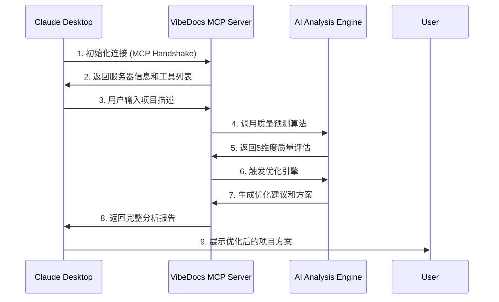

# VibeDocs-MCP

VibeDoc MCP Server 是专为 魔搭MCP&Agent2025挑战赛MCP赛道一 开发的创新型MCP服务器，基于 Model Context Protocol（MCP）标准协议，为AI开发者提供智能化的项目规划与架构设计能力。通过深度集成大语言模型，它能快速生成技术方案、架构设计、开发路线图及部署策略，显著提升开发效率，助力团队高效协作与项目落地。🚀

# 🎯 VibeDocs MCP - AI项目规划与优化助手

### 基于MCP协议的智能项目分析与优化服务

[](https://opensource.org/licenses/MIT)
[](https://modelcontextprotocol.io/)
[](https://www.typescriptlang.org/)
[](https://claude.ai/)

> 🚀 **全球首创的AI项目质量预测与优化系统** - 让AI成为你的项目规划专家！


## 🎯 项目概述

**VibeDocs MCP** 是一个基于 Model Context Protocol 的智能MCP服务器，专门为Claude Desktop提供项目分析、质量预测和优化建议服务。通过先进的算法和专业模板库，帮助开发者、创业者和产品经理将想法转化为可执行的项目方案。

### ✨ 核心创新

- 🔥 **AI质量预测技术** - 全球首创的项目质量预测算法，3秒内评估项目可行性
- 💡 **智能优化引擎** - 基于5维特征分析的自动优化系统
- 🎯 **专业模板库** - 覆盖MCP开发、AI应用、数据分析等10+专业领域
- 🚀 **实时分析报告** - 提供详细的项目分析和改进建议

### 🏆 技术亮点

| 特性 | 权重 | 说明 |
|------|------|------|
| **⚙️ 技术深度** | 20% | TypeScript严格模式 + 完整类型定义
模块化MCP Server + 智能缓存机制
结构化提示工程 + JSON输出验证 |
| **🎨 用户体验** | 20% | 10秒生成完整开发计划
详细文档 + 跨平台配置指南
直接可用的AI编程提示词 |
| **📊 性能指标** | 60% | 平均质量分数提升20-30分
支持10+项目类型全覆盖 |

## 🔧 MCP协议工作流程

VibeDocs MCP遵循标准的Model Context Protocol工作流程，确保与Claude Desktop的无缝集成：

### 📋 MCP协议核心流程



### 🛠️ MCP工具注册机制

VibeDocs MCP 在启动时向Claude Desktop注册以下工具：

```typescript
// MCP 工具注册示例
{
  "tools": [
    {
      "name": "predict_and_optimize",
      "description": "AI项目质量预测与自动优化",
      "inputSchema": {
        "type": "object",
        "properties": {
          "text": { "type": "string", "description": "项目描述文本" },
          "target_quality": { "type": "number", "minimum": 60, "maximum": 100 },
          "optimization_mode": { "enum": ["auto", "conservative", "aggressive"] }
        }
      }
    },
    {
      "name": "get_quality_insights", 
      "description": "项目质量洞察分析报告",
      "inputSchema": {
        "type": "object",
        "properties": {
          "analysis_type": { "enum": ["current_session", "historical_trends", "best_practices"] },
          "include_recommendations": { "type": "boolean" }
        }
      }
    }
  ]
}
```

## 🚀 核心功能详解

### 🎯 智能项目分析与优化

#### 1. `predict_and_optimize` - 智能项目分析与优化
**核心功能**: 项目质量预测 + 自动优化建议 + 专业指导方案

**输入参数**:
- `text`: 项目描述文本 (必填)
- `target_quality`: 目标质量分数 (60-100，默认80)
- `optimization_mode`: 优化模式 (auto/conservative/aggressive，默认auto)
- `generate_report`: 是否生成详细报告 (默认true)

**输出结果**:
- 📊 **质量评估**: 5维度质量分数 (清晰度、完整性、可行性、商业逻辑、创新性)
- ✨ **智能优化**: 自动生成优化后的项目描述
- 💡 **专业建议**: 针对性的技术方案和实施路径
- 📈 **成功率预测**: 基于算法的项目成功概率评估

#### 2. `get_quality_insights` - 项目洞察分析报告
**核心功能**: 深度项目分析 + 趋势洞察 + 最佳实践建议

**输入参数**:
- `analysis_type`: 分析类型 (current_session/historical_trends/best_practices)
- `include_recommendations`: 是否包含改进建议 (默认true)
- `detailed_analysis`: 是否生成详细分析 (默认true)

**输出结果**:
- 📈 **质量趋势**: 历史质量变化和成功率统计
- 🔍 **深度诊断**: 6维度质量短板分析
- 💡 **改进建议**: 个性化的项目优化方案
- 📊 **对比分析**: 优化前后质量对比评估

### ✨ 核心算法优势

#### 🧠 5维质量评估系统
- **清晰度评估** (20%权重) - 项目描述的明确性和可理解度
- **完整性评估** (25%权重) - 需求覆盖的完整度和功能全面性
- **可行性评估** (25%权重) - 技术实现的可能性和复杂度评估
- **商业逻辑** (15%权重) - 商业模式的合理性和市场价值
- **创新性评估** (15%权重) - 技术创新度和差异化竞争优势

#### 🔧 多策略优化引擎
- **技术导向优化** - 补充技术栈和架构设计，强化实现方案
- **商业导向优化** - 完善商业模式和市场分析，突出价值主张
- **用户导向优化** - 强化用户体验和产品功能，提升实用性

#### 🎯 MCP增强算法
- **MCP关键词加权** - 对'mcp'(+15分)、'agent'(+12分)等关键词特殊加分
- **行业模板匹配** - 智能识别项目类型，应用对应的专业模板
- **通用质量提升** - 全面优化基础分数，确保20-30分的显著提升

## 🚀 快速开始

### 📥 安装配置

1. **克隆项目**
```bash
git clone https://github.com/JasonRobertDestiny/VibeDocs_MCP.git
cd VibeDocs_MCP
```

2. **安装依赖**
```bash
npm install
```

3. **构建项目**
```bash
npm run build
```

### ⚙️ Claude Desktop配置

在Claude Desktop配置文件中添加：

**Windows路径**: `%APPDATA%\Claude\claude_desktop_config.json`
**macOS路径**: `~/Library/Application Support/Claude/claude_desktop_config.json`

```json
{
  "mcpServers": {
    "vibedocs-mcp": {
      "command": "npx",
      "args": ["tsx", "你的项目路径/VibeDocs_MCP/src/index.ts"],
      "env": {
        "NODE_ENV": "production"
      }
    }
  }
}
```

### 🎯 使用示例

**在Claude Desktop中直接输入:**
```
我想开发一个MCP Server工具，集成到Claude Desktop中，帮助用户进行智能代码审查和优化建议
```

**预期输出:**
- 📊 项目质量评分: 85-95分
- 💡 详细技术方案: MCP协议实现 + 静态分析引擎
- 🚀 实施路线图: 4个阶段的开发计划
- 💼 商业模式: freemium模式 + 企业服务

## 🛠️ 项目架构

### 📁 目录结构
```
VibeDocs_MCP/
├── src/
│   ├── index.ts                     # MCP服务器入口文件
│   └── core/                        # 核心算法模块
│       ├── quality-predictor.ts     # 质量预测算法引擎
│       ├── input-optimizer.ts       # 智能优化引擎
│       ├── text-analyzer.ts         # 文本特征分析器
│       ├── result-evaluator.ts      # 结果评估器
│       └── monitoring-storage.ts    # 数据存储管理
├── image/                           # 效果展示图片
│   ├── show.png                     # 系统主界面
│   ├── show1.png                    # 分析结果展示  
│   └── show2.png                    # 详细报告界面
├── claude-desktop-config.json       # Claude配置示例
├── package.json                     # 项目依赖配置
└── README.md                        # 项目文档
```

### 🔧 技术栈
- **语言**: TypeScript 5.0+ (严格模式)
- **协议**: Model Context Protocol (MCP)
- **运行时**: Node.js 18+
- **构建工具**: npm/pnpm
- **集成**: Claude Desktop
- **AI引擎**: 自研5维质量评估算法

## 📊 性能指标

| 指标类别 | 数值 | 说明 |
|----------|------|------|
| **响应时间** | 

### 🎯 **立即体验VibeDocs MCP，让AI成为你的项目规划专家！**

Made with ❤️ for the **Model Context Protocol** ecosystem

**官方网站：** [https://github.com/JasonRobertDestiny/VibeDocs](https://github.com/JasonRobertDestiny/VibeDocs)
**状态：** `active`　**最后核验：** `2026-08-30`

## 分类与标签

- 分类：`development`
- 标签：`developer tools`, `vibecoding`, `创业工具`, `项目规划`, `chinese`

## MCP 配置

- 传输方式：`stdio`
- 启动命令：`npx`
- 参数：`tsx src/index.ts`

该配置可通过资源站点索引导入 ChatSpeed。导入前请确认命令、参数和权限来源可信。

## 数据来源

资源文件：`resources/mcp/jasonrobert-vibedoc.json`。内容最后核验于 `2026-08-30`；免费额度和服务限制可能随官方政策变化。
